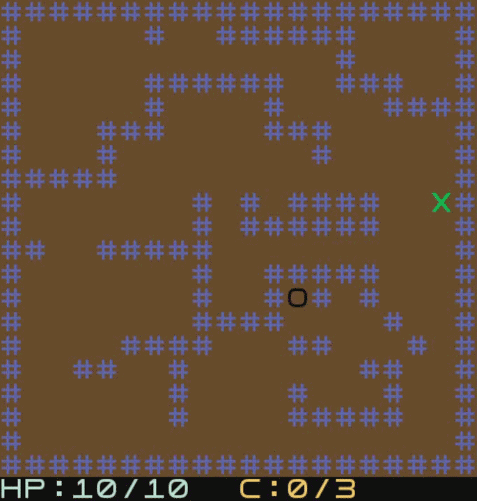

# LDTS_G0806

## Game description

The game is based on the Hero project developed in the practical Labs, with some additional tweaks.
Initially, the Player, spawns in an empty Room with Walls and a Gate, and has a default Weapon and health stats. Every X (to be defined) seconds the Player dies, respawning inside the first Room.
The Player has a <b>maximum HP</b> stat which limits the possible current HP. If the Player dies, he respawns in the initial Room with full HP.
The maximum HP can be increased through some Potions.

Upon entering the Gate, the Player enters a new Room which has Monsters in it. In order to open the Gate and
progress to the next Room, the Player must kill every single Monster, until it eventually encounters the Final Boss, which he must defeat in order to beat the game.

For a more detailed explanation of our game please click <a href="docs/README.md"> here. </a>

This project was designed by:
<ul>
<li>João Paulo Luís, up201805032@fc.up.pt</li>
<li>Guilherme Soares Sequeira, up202004648@fe.up.pt</li>
<li>Pedro Miguel Ramalho, up202004715@fe.up.pt</li>
</ul>

## Screenshots and GIFS

<b><i>Gif 1. - Player moving and colliding with walls </i></b>

 

<b><i>Gif 2. - Player shooting bullets that vanish because they reached max range</i></b>

 

<b><i>Gif 3. - Player opening and crossing a passage (to a different depth)</i></b>

 

<b><i>Gif 4. - Player dying and respawning </i></b>

 

<b><i>Gif 5. - Player slaying a monster</i></b>

 