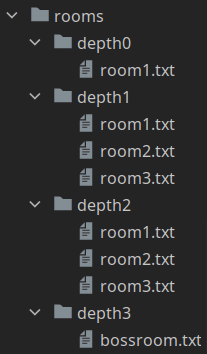
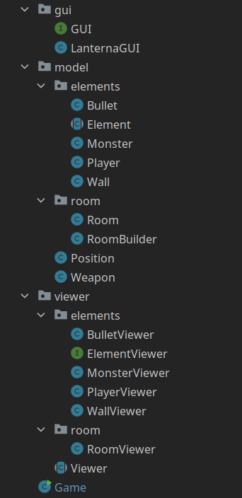

# LDTS_G0806

## Game description

The game is based off the Hero project developed in the practical Labs, with some additional tweaks. The player spawns in a Room with Walls and Monsters and must use its Weapon to kill the Monsters. Once the Player has killed every single Monster, a Gate opens up. If the player goes through the Gate, he advances to the next Room, untill he encounters the Final Boss which he must defeat in order to win the game.

This project was designed by:
<ul>
<li>João Paulo Luís, up201805032@fc.up.pt</li>
<li>Guilherme Soares Sequeira, up202004648@fe.up.pt</li>
<li>Pedro Miguel Ramalho, up202004715@fe.up.pt</li>
</ul>

## Implemented Features

Before we talk about the implemented features we must explain the state of our project.
Currently we have 2 important branches, <b><i>master</i></b> and <b><i>refactoring</i></b>.

On the <b><i>master</i></b> branch we followed TDD with no real design or architectural pattern in mind - we wrote tests and some hardcode to make them pass. However, the logic behind
the game is there - moving the Player, moving the Monster, shooting the Bullets... the logic is all there. So, in our <b><i>master</i></b> branch
the current implemented features are:
<ul>
<li><b>Keyboard control</b> - the user interacts with the game screen through the keyboard, every action is interpreted through a keyboard input made by the user.</li>

<li><b>Player movement</b> - the player is allowed to move with the keyboard, using the arrow keys. If the user enters (collides) the Gate a new Room is loaded.</li>

 <b><i>Fig. 1 - Player movement and Gate collision</i></b>

<li><b>Player combat</b> - the player shoots Bullets off of his Weapon if he presses <b>x</b>, damaging and killing the Monsters he hits.</li>

 <b><i>Fig. 2 - Player combat, shooting Bullets, damaging and killing a Monster</i></b>

<li><b>Monster movement</b> - the monsters are constantly moving in random directions.</li>

 <b><i>Fig. 3 - Monsters constantly moving in random directions</i></b>

<li><b>Monster combat</b> - the monsters are also capable of damaging the Player. If the Player dies, he respawns at the initial room. The color of each Monster and Player indicate their health percentage.</li>

 <b><i>Fig. 4 - Monsters damaging and killing a Player</i></b>

<li><b>Different levels</b> - 3 different <i>levels</i> (we call them depths) with an increasing difficulty (at the moment the Monsters have slightly more health in lower depths.</li>

 <b><i>Fig. 5 - Different levels available in our game</i></b>

<li><b>Collision detection</b> - collisions between different objects are verified (e.g. Player and Wall collisions)</li>
</ul>

The <b><i>refactoring</i></b> branch, as the name suggests, is where we're refactoring our code to make it cleaner, bug free and also more sustainable.
We're still using TDD, but our tests are new and improved. At the moment, no entity is allowed to move. We have completed the <b>Model</b> and the <b>View</b> portion of each entity, but none of them moves yet. This will be implemented in the future.
Therefore, the current features we have at the moment which are tested and working are the creating and displaying on screen of every element in our game.

## Planned features

The features we would like to add to our game are the following:
<ul>
<li>A new and improved color scheme and a custom font, designed specifically for our game</li>
<li>New Weapons for the Player which will increase the diversity of combat techniques</li>
<li>Different types of Monsters with different attributes (different health, damage, attack movement, ...)</li>
<li>Potions and Effects which will boost the Player in various ways</li>
<li>A challenging Boss Fight</li>
<li>A menu which will allow the Player to Play, read the game Instructions or Exit</li>
</ul>

## Design

### General Structure

##### Problem in Context

Design-wise our first concern was how to efficiently structure the project. Since we are dealing with a GUI and our game has different elements which need to be displayed on screen, we chose some patterns in order to fulfill our goals in the best way possible.

##### The Pattern

The pattern which we are currently following is the <b>Architectural Pattern</b>, more specifically the <b>Model-View-Controller</b> style, which is commonly used in a GUI.

##### Implementation

Regarding the implementation, we now have classes which main purpose is to store data (Models) and classes that are responsible for
the visual effects on screen (Viewers). The logic of the game will be handled by the Controllers.

    

 <b><i>Fig. 6 - Model and Viewer pattern design</i></b>

##### Consequences

The use of the Model and View pattern for our objects makes it possible for our code to acknowledge the <b><i>Single Responsibility Principle</b></i> and also makes it very easy to add new features throughout the future development of our game.
