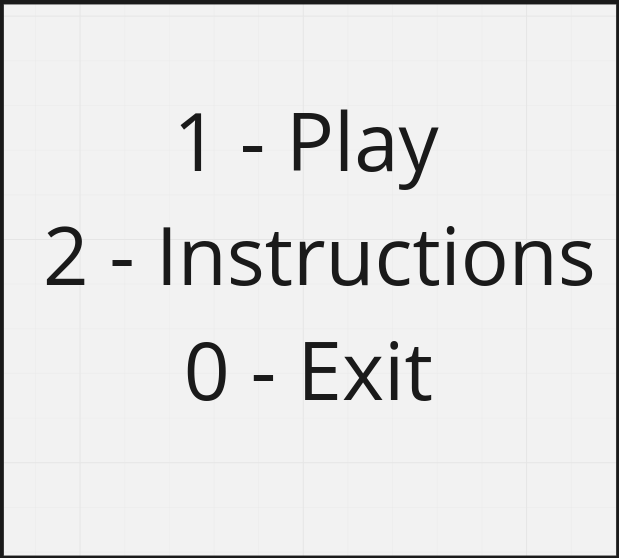

# LDTS_G0806

## Game description

The game is based on the Hero project developed in the practical Labs, with some additional tweaks. 
Initially, the Player, spawns in an empty Room with Walls and a Passage, and has a default Weapon and health stats. Every X (to be defined) seconds the Player dies, respawning inside the first Room. 
The Player has a <b>maximum HP</b> stat which limits the possible current HP. If the Player dies, he respawns in the initial Room with full HP.
The maximum HP can be increased through some Potions.

Upon entering the Passage, the Player enters a new Room which has Monsters in it. In order to open the Passage and
progress to the next Room, the Player must kill every single Monster, until it eventually encounters the Final Boss, which he must defeat in order to beat the game.

This project was designed by:
<ul>
<li>João Paulo Luís, up201805032@fc.up.pt</li>
<li>Guilherme Soares Sequeira, up202004648@fe.up.pt</li>
<li>Pedro Miguel Ramalho, up202004715@fe.up.pt</li>
</ul>

## Implemented Features

The current implemented features are:
<ul>
<li><b>Keyboard control</b> - the user interacts with the game screen through the keyboard, every action is interpreted through a keyboard input made by the user.</li>
<li><b>Player combat</b> - the player shoots Bullets off of his Weapon if he presses <b>x</b>, damaging and killing the Monsters he hits.</li>
<li><b>Monster movement</b> - the monsters are constantly moving in random directions.</li>
<li><b>Monster combat</b> - the monsters are also capable of damaging the Player. If the Player dies, he respawns at the initial room. The color of each Monster and Player indicate their health percentage.</li>
<li><b>Different levels</b> - 3 different <i>levels</i> (we call them depths) with an increasing difficulty (at the moment the Monsters' health and damage scale with the room's depth depth).</li>
<li><b>Collision detection</b> - collisions between different objects are verified (e.g. Player and Wall collisions)</li>
</ul>

## Planned features

The features we would like to add to our game are the following:
<ul>
<li>A new and improved color scheme and a custom font, designed specifically for our game</li>
<li>New Weapon upgrades for the Player which will increase the diversity of combat techniques</li>
 

<b><i>Fig. 1 - Weapon pickup mock</i></b>

 

<b><i>Fig. 2 - Weapon pickup menu mockup</i></b>
 
 

<li>Different types of Monsters with different attributes (different health, damage, attack strategies, ...)</li>
 

<b><i>Fig. 3 - Different monsters mockup</i></b>

<li>Potions and Effects which will aid the Player in various ways</li>
 

<b><i>Fig. 4 - Potions and Effects mockup</i></b>

 

<li>A challenging Boss Fight (to be defined)</li>

<li>A menu which will allow the Player to Play, read the game Instructions or Exit</li>
</ul>
 

<b><i>Fig. 5 - Main Menu mockup</i></b>

 

## Design

### General Structure

<b><i>Fig. 6 - General Structure of the project</i></b>

 

##### Problem in Context

Design-wise our first concern was how to efficiently structure the project. Since we are dealing with a GUI and our game has different elements which need to be displayed on screen, we chose some patterns in order to fulfill our goals in the best way possible.

##### The Pattern

We are currently following the <b>Model-View-Controller Architectural Pattern</b>, which is commonly used in programs with a GUI.

##### Implementation

Regarding the implementation, we now have classes which main purpose is to store data (Models) and classes that are responsible for
the visual effects on screen (Viewers). The logic of the game will be handled by the Controllers.

    

 <b><i>Fig. 7 - Model and Viewer pattern design</i></b>

 

##### Consequences

The use of the Model and View pattern for our objects makes it possible for our code to acknowledge the <b><i>Single Responsibility Principle</b></i> and also makes it easier to add new features throughout the future development of our game.

### Room Builder

#### Problem in Context

Our game will take place in various rooms, which are read from a text file. 
A room is a complex object, composed of various objects of different Classes. 
As such, we need to find a flexible and simple way of assembling and building each room.

#### The Pattern

The pattern chosen for this problem is the Builder Pattern.
The intent of the Builder design pattern is to separate the construction of a complex object from its representation. By doing so, the same construction process can create different representations (rooms).

#### Implementation

In our project, the RoomBuilder Class is responsible for reading text files, constructing the elements which compose the room and finally assembling the Room itself. It applies the Builder pattern, since
it divides the building of the room in simpler and smaller steps (createWalls(), createMonsters(), ...).

    

 <b><i>Fig. 8 - Builder pattern design</i></b>

 

#### Consequences

By following this pattern we are avoiding tight relationships between the creation and the concrete product of a Room,
by encapsulating the creating and assembling process within a different Class. 

### GUI

#### Problem in Context

Displaying the game through the Lanterna library is a complex task, which
our game shouldn't be affected by. Therefore, we need to find a simplified way of fulfilling
our game displaying needs.

#### The Pattern

By applying the Facade Pattern, we get a simple interface of a complex subsystem (Lanterna), which allows us
to only include the necessary features.

#### Implementation

The simplified <b>GUI</b> Interface contains the necessary methods to display our game,
which are implemented by the <b>LanternaGUI</b> Class. This Class then goes on to use
the necessary methods from the Lanterna library.

    

 <b><i>Fig. 9 - Simplified LanternaGUI design</i></b>

 

## Testing

### Test Coverage

 <b><i>Fig. 10 - Test coverage </i></b>
 

### Self-evaluation

The work was divided in a mutual way and we all contributed our best.

<ul>
<li>João Paulo Luís: 33.3%</li>
<li>Guilherme Soares Sequeira: 33.3%</li>
<li>Pedro Miguel Ramalho: 33.3%</li>
</ul>

### Important mentions

It is important to mention that some portions of code developed
in the practical Labs were reused in our project.

We were also guided by professor <a href="https://github.com/arestivo"> André Restivo </a> and his projects and work, more remarkably:
<ul>
<li> <a href="https://github.com/arestivo/hero-solid"> Hero SOLID</a></li>
<li> <a href="https://github.com/arestivo/designpatterns-hero"> Hero Design Patterns</a></li>
<li> <a href="https://web.fe.up.pt/~arestivo/presentation/solid/#1"> SOLID Principles Slides</a></li>
<li> <a href="https://web.fe.up.pt/~arestivo/presentation/gamepatterns/#1"> Design Patterns for Game Development</a></li>
</ul>