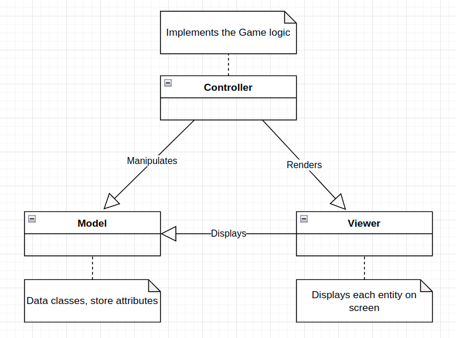
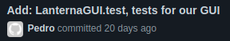

# LDTS_G0806

## Game description

The game is based on the Hero project developed in the practical Labs, with some additional tweaks. 
Initially, the Player, spawns in an empty Room with Walls and a Passage, and has a default Weapon and health stats. Every 180 seconds the Player dies, respawning inside the first Room. 
The Player has a <b>maximum HP</b> stat which limits the possible current HP. If the Player dies, he respawns in the initial Room with full HP.
The maximum HP can be increased through some Potions.

Upon entering the Passage, the Player enters a new Room which has Monsters in it. In order to open the Passage and
progress to the next Room, the Player must kill every single Monster, until it eventually encounters the Final Boss, which he must defeat in order to beat the game.

This project was designed by:
<ul>
<li>João Paulo Luís, up201805032@fc.up.pt</li>
<li>Guilherme Soares Sequeira, up202004648@fe.up.pt</li>
<li>Pedro Miguel Ramalho, up202004715@fe.up.pt</li>
</ul>

## Implemented Features

The current implemented features are:
<ul>
<li><b>Keyboard control -</b> the user interacts with the game screen through the keyboard, every action is interpreted through a keyboard input made by the user.</li>
<li><b>Player combat -</b> the player shoots Bullets off of his Weapon if he presses <b>x</b>, damaging and killing the Monsters he hits.</li>
<li><b> Regular Monster movement -</b> the monsters (Zombies and Skeletons) are constantly moving in random directions.</li>
<li><b> Boss movement - </b> the Boss moves to the square which is closest to the Player.</li>
<li><b> Monster combat - </b>the monsters are also capable of damaging the Player. Zombies will bite the Player if he gets too close. The Skeletons, on top of biting, also have a chance of shooting Bullets which damage the Player. If the Player dies, he respawns at the initial room. The color of each Monster and Player indicate their health percentage.</li>
<li><b> Boss combat -</b> the Boss does an area of effect  attack by firing bullets in every direction within 2 squares. The bullets have a maximum range of 1. Additionally, the Boss also fires
bullets in every cardinal direction, which have a maximum range of 10.</li>
<li><b> Different levels -</b> 3 different <i>levels</i> (we call them depths) with an increasing difficulty (at the moment the Monsters' health and damage scale with the room's depth).</li>
<li><b> Menus -</b> there's a Main Menu where the Player can choose to Play, view the Controls and Exit the game. There is also a Weapon Menu which displays
the differences in stats between the Player's current Weapon and the new Weapon (the Player can then choose if he wants to swap Weapons or not) and a Victory Menu, which displays
when the Player kills the Boss (wins the game).</li>
<li><b> Items -</b> there are special Potions and Weapons, dropped from Monsters, which boost the Player in various ways. The effects given to
the Player by these Items scale with the Room's depth.</li>
<li><b>Collision detection -</b> collisions between different objects are verified (e.g. Player and Wall collisions)</li>

</ul>

## Planned features

All planned features were implemented successfully.

## Design

### General Structure

<p align="center">

</p>
<p align="center"><b><i>Fig. 1 - General Structure of the project</i></b></p>
<br>

#### Problem in Context

Design-wise our first concern was how to efficiently structure the project. Since we are dealing with a GUI and our game has different elements which need to be displayed on screen, we chose some patterns in order to fulfill our goals in the best way possible.

#### The Pattern

We are currently following the <b>Model-View-Controller Architectural Pattern</b>, which is commonly used in programs with a GUI.

#### Implementation

Regarding the implementation, we now have classes which main purpose is to store data (Models) and classes that are responsible for
the visual effects on screen (Viewers). The logic of the game will be handled by the Controllers.

<p align="center">
    
</p>

<p align="center"> <b><i>Fig. 2 - Model and Viewer pattern design</i></b></p>
<br>

#### Consequences

The use of the Model and View pattern for our objects makes it possible for our code to acknowledge the <b><i>Single Responsibility Principle</b></i> and also makes it easier to add new features throughout the future development of our game.

### Room Builder

#### Problem in Context

Our game will take place in various rooms, which are read from a text file. 
A room is a complex object, composed of various objects of different Classes. 
As such, we need to find a flexible and simple way of assembling and building each room.

#### The Pattern

The pattern chosen for this problem is the Builder Pattern.
The intent of the Builder design pattern is to separate the construction of a complex object from its representation. By doing so, the same construction process can create different representations (rooms).

#### Implementation

In our project, the RoomBuilder Class is responsible for reading text files, constructing the elements which compose the room and finally assembling the Room itself. It applies the Builder pattern, since
it divides the building of the room in simpler and smaller steps (```createWalls()```, ```createMonsters()```, ...).

<p align="center">
    
</p>

<p align="center"> <b><i>Fig. 3 - Builder pattern design</i></b></p>
<br>

#### Consequences

By following this pattern we are avoiding tight relationships between the creation and the concrete product of a Room,
by encapsulating the creating and assembling process within a different Class. 

### GUI

#### Problem in Context

Displaying the game through the Lanterna library is a complex task, which
our game shouldn't be affected by. Therefore, we need to find a simplified way of fulfilling
our game displaying needs.

#### The Pattern

By applying the Facade Pattern, we get a simple interface of a complex subsystem (Lanterna), which allows us
to only include the necessary features.

#### Implementation

The simplified <b>GUI</b> Interface contains the necessary methods to display our game,
which are implemented by the <b>LanternaGUI</b> Class. This Class then goes on to use
the necessary methods from the Lanterna library.

<p align="center">
    
</p>

<p align="center"> <b><i>Fig. 4 - Simplified LanternaGUI design</i></b></p>
<br>

### Game states

#### Problem in Context

We needed our program to keep track and react differently to input based on what stage of the game it was on. We needed
to find an easy way to not only allow us to implement the existing states, but also make it flexible enough to
allow us to add different states in the future, if we so wished to do.

#### The Pattern

By using the State Pattern, we allow our Context (Game) to accept objects of a State type, which dictates
how the Context behaves.

#### Implementation

At the start of the program, Game is initially at the <b>MainMenuState</b>, but depending on user input it can
transition to other states, like <b>ControlsMenuState</b> or the <b>GameState</b>. The latter can then transition
to the <b>MainMenuState</b>, <b>WeaponsMenuState</b> or <b>VictoryMenuState</b> depending on user input or game
events, like defeating the boss or walking on top of a WeaponItem.

<p align="center">
    
</p>

<p align="center"> <b><i>Fig. 5 - State design pattern</i></b></p>
<br>

### Observers and Listeners

#### Problem in Context

Our Game has many components: monsters, bullets, a player, etc. We needed to find a way
of detecting collisions between all of these elements without constantly checking for their
positions and also removing them from the Room once their HP was equal to 0, in the case of monsters
and the player, or when they had collided with another entity or reached its max range, in the case
of bullets.

#### The Pattern

We decided to apply the Observer pattern, which let us notify multiple objects about
specific events that happen to the object they're observing and react accordingly.

#### Implementation

In our program, we decided that our <b>Room</b> would be the observer of the various components that
exist within it, although this should have been, arguably, the <b>RoomController</b>'s job. It is
notified whenever a Monster or Player moves or has its HP changed, as well as when a Bullet has
decayed. In this way, the pattern allowed us to solve the problems we had.

<p align="center">
    
</p>

<p align="center"> <b><i>Fig. 6 - Observer design pattern</i></b></p>
<br>

### Strategies

#### Problem in Context

We wanted our monsters to have various types of attacks and movement and we needed a simplified
way to do so.

#### The Pattern

We decided to apply the Strategy Pattern, which allows us to have multiple interchangeable
strategies for doing a specific task, like attacking or moving.

#### Implementation

Our context (Monster) has an attack strategy field and a movement strategy field, which are 
interchangeable. In this way, our concrete implementations of Monster can have various ways to 
attack and move, which are flexible to being changed and allows us to easily add other ones if needed.

<p align="center">
    
</p>

<p align="center"> <b><i>Fig. 7 - Strategy design pattern</i></b></p>
<br>

## Known Code Smells and Refactoring Suggestions

#### Data Class

All models are Data Classes. They contain only fields and no behavior or logic. This is caused by
the <b>MVC</b> architectural pattern which holds the responsibility to the controller to implement
the logic functionalities of each model and the displaying portion to the viewer. 
We believe this is not a bad code smell since it only exists due to our chosen architectural pattern.

#### Long Class

Some Classes (e.g ``Room.java``, 200+ lines) contain many fields and methods (e.g. ```LanternaGUI.java```). We find this to be
justifiable since the Classes require these fields in order to fully implement the Game itself.
The Room Class is responsible for holding every object inside it (Player, Monsters, Bullets...) and checking 
for collisions between these objects. In the other hand, the LanternaGUI Class is
responsible for displaying every object on screen. Therefore, we believe this is not a bad code smell.

#### Long Method

Some methods (e.g ``Room.setMonsterObservers()``) are long (20+ lines). In this case, we find it
justifiable for the method to be this long since it's where we're setting up the Monster observers (as the name suggests).

#### Long Parameter List

There are Classes (e.g ``Room.java``) and methods/constructors (e.g. constructor of ``Bullet.java``) that have
a long list of parameters. In the first case, since the Room is the "container" of every component of our Game,
we find it justifiable. In the second case, we believe it's not a bad code smell since every Bullet needs those parameters.

#### Alternative Classes with different interfaces

Since we have different types of Monsters we decided to create a general abstract Monster Class.
Classes which extend this generalized Class (``Zombie.java``, ``Skeleton.java`` and ``Boss.java``) have different field
values (damage, health...). They have no other significant functions or methods, so they're an example of
<b>Alternative Classes with different interfaces.</b> 


#### Important Observation

During the development of our program, we decided that our <b>Room</b> (Model) should be the 
observer to its entities (monsters, player, bullets). However, the further we got into the development
process, the more obvious the problems that came with this decision became. For one, our <b>Room</b> class
became way bigger than others (as mentioned in the Long Class section). We also believe that the
logic that came with the observers were better suited to be in the <b>RoomController</b>. Finally,
due to the impossibility of accessing the <b>Game</b>'s <b>State</b> stack, we had to make it <i>static</i> which
can also be considered a bad practice. These issues could be fixed by making the <b>RoomController</b> the observer instead.


## TDD Process, Branches and Testing

### The TDD process

Test-driven development consists on converting software requirements
to test cases before the software itself is fully developed,  and tracking all software development by 
repeatedly testing the software against all test cases.

For this project we were asked to do 3 commits per "feature":
<ol>
    <li> Commit the <b>interface</b> (the "skeleton" of the Class/Method) </li>
    <li> Commit the <b>tests</b> for said interface</li>
    <li> Commit the <b>implementation</b></li>
</ol>

Below are screenshots of two separate implementations, following TDD:

#### Case 1

<p align="center">
    
</p>

<p align="center"> <b><i>Fig. 8 - Comitting the Interface + Tests for the LanternaGUI Class</i></b></p> 
<br>

<p align="center">
    
</p>

<p align="center"> <b><i>Fig. 9 - Comitting the Implementations for the LanternaGUI Class</i></b></p> 
<br>

#### Case 2

<p align="center">
    
</p>

<p align="center"> <b><i>Fig. 10 - Comitting the Interface + Tests for the BulletViewer Class</i></b></p> 
<br>

<p align="center">
    
</p>

<p align="center"> <b><i>Fig. 11 - Comitting the Implementations for the BulletViewer Class</i></b></p> 
<br>

### Branches and Workflow

We made use of Git branches during the development of our project.
A feature had a corresponding branch where it was developed and tested.

Below is a screenshot of our branches:

<p align="center">
    
</p>

<p align="center"> <b><i>Fig. 12 - Different branches of our project</i></b></p> 
<br>

<ul>
<li><b>master - </b> final branch with fully implemented features</li>
<li><b>feature/controller - </b> branch where we added the Controllers for each entity of our game</li>
<li><b>feature/newmonsters - </b> branch where we added new types of Monsters</li>
<li><b>refactoring - </b> branch where we refactored our code</li>
<li><b>simplified-font - </b> branch where we switched the font of our Game</li>
</ul>

### Test Coverage and PIT Testing

#### Controller Coverage

<p align="center">

</p>
<p align="center"> <b><i>Fig. 13 - Controller tests coverage </i></b>
<br>

#### GUI Coverage

<p align="center">

</p>
<p align="center"> <b><i>Fig. 14 - GUI tests coverage </i></b>
<br>

#### Model Coverage

<p align="center">

</p>
<p align="center"> <b><i>Fig. 15 - Model tests coverage </i></b>
<br>

#### State Coverage

<p align="center">

</p>
<p align="center"> <b><i>Fig. 16 - State tests coverage </i></b>
<br>

#### Viewer Coverage

<p align="center">

</p>
<p align="center"> <b><i>Fig. 17 - Viewer tests coverage </i></b>
<br>

#### PIT Test Report (Mutation testing)

<p align="center">

</p>
<p align="center"> <b><i>Fig. 18 - PIT report </i></b>
<br>

#### Libraries and technologies used

<ul>
<li>JUnit</li>
<li>Mockito</li>
<li>PIT Mutation Testing</li>
<li>JQWIK for Property Based Testing</li>
</ul>

<i>Note: JQWIK is incompatible with PIT. The tests which use JQWIK are commented
and can be found at</i> ``test/feup.ldts.proj/controller/game/elements/bullets/MonsterBulletControllerTest.java`` and ``test/feup.ldts.proj/controller/game/elements/bullets/PlayerBulletControllerTest.java``.

### Self-evaluation

<ul>
<li>João Paulo Luís: 20.0%</li>
<li>Guilherme Soares Sequeira: 40.0%</li>
<li>Pedro Miguel Ramalho: 40.0%</li>
</ul>

### Important mentions

It is important to mention that some portions of code developed
in the practical Labs were reused in our project.

The development of this report followed an example report provided
by our professors. Note that some UML designs follow the example report UML's (e.g. the MVC UML).

We were also guided by professor <a href="https://github.com/arestivo"> André Restivo </a> and his projects and work, more remarkably:
<ul>
<li> <a href="https://github.com/arestivo/hero-solid"> Hero SOLID</a></li>
<li> <a href="https://github.com/arestivo/designpatterns-hero"> Hero Design Patterns</a></li>
<li> <a href="https://web.fe.up.pt/~arestivo/presentation/solid/#1"> SOLID Principles Slides</a></li>
<li> <a href="https://web.fe.up.pt/~arestivo/presentation/gamepatterns/#1"> Design Patterns for Game Development</a></li>
</ul>